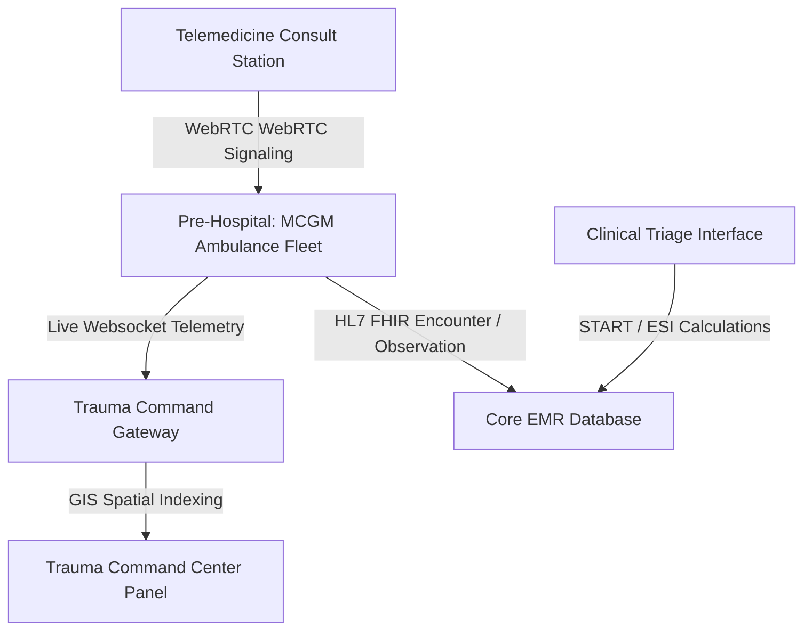
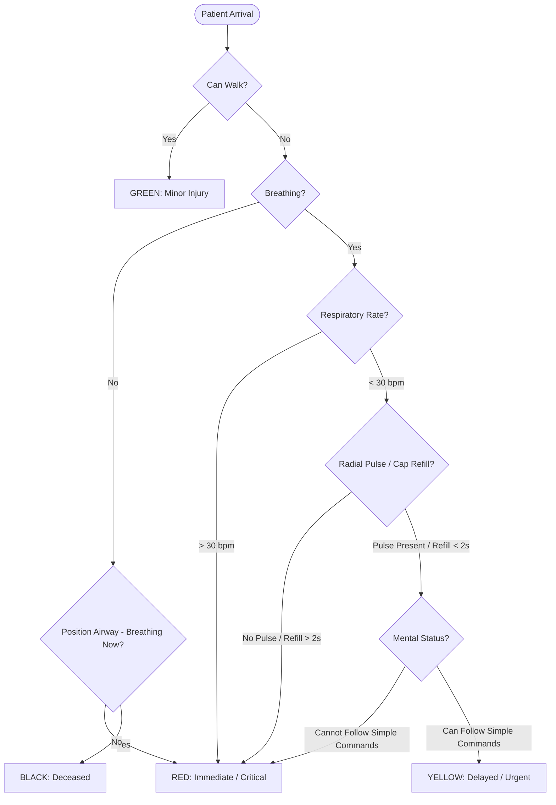

# MCGM Trauma Emergency OS Architecture & Integration Specifications

This document outlines the technical design, data structures, clinical triage protocols, and HL7 FHIR interface standards powering the next-generation **MCGM Trauma Emergency Care & Command Platform**.

---

## 1. System Architecture Overview

The Emergency OS provides real-time trauma management, fleet GIS routing, and telemedicine linkages. It operates on a high-availability, low-latency publish-subscribe model syncing EMS telemetry with hospital-side trauma bays.



### Key Architectural Modules:
1. **Trauma Command Center (Tab 1)**: Visualizes regional incidents (fire outbreaks, road traffic accidents), GIS ambulance map routing, and trauma bay/ICU bed occupancies.
2. **AI Dispatcher Workspace (Tab 2)**: Automatically matches incidents with available vehicles, forecasting dispatch recommendations.
3. **Ambulance Fleet Status (Tab 3)**: Monitors fuel levels, equipment checks (AED, ventilator, oxygen supply), and crew credentials.
4. **Paramedic Pre-Hospital Portal (Tab 4)**: Renders mobile-first live vital feeds and patient information logged from the field.
5. **ESI/START Triage Engine (Tab 5)**: Clinically assists trauma doctors in categorizing emergency arrivals using physiology scoring metrics.
6. **Disaster Management (Tab 6)**: Toggles mass casualty incident (MCI) resource locking and state control reporting.

---

## 2. Clinical Protocols & Triage Logic

The platform supports two standard emergency triage systems: **START (Simple Triage and Rapid Treatment)** for disasters, and **ESI (Emergency Severity Index)** for standard hospital triage.

### 2.1 physiological Trauma Scoring Metrics
* **Glasgow Coma Scale (GCS)**: Combined score of Eye (1-4), Verbal (1-5), and Motor (1-6) responses. A score $\le 8$ prompts immediate intubation guidelines.
* **Revised Trauma Score (RTS)**: Calculated using GCS, Systolic Blood Pressure (SBP), and Respiratory Rate (RR):
  $$\text{RTS} = 0.9368 \times \text{GCS}_{\text{value}} + 0.7326 \times \text{SBP}_{\text{value}} + 0.2908 \times \text{RR}_{\text{value}}$$
  Where values are coded 0 to 4 based on clinical ranges.

### 2.2 START Triage Logic Flowchart



---

## 3. HL7 FHIR Emergency Resource Mappings

All pre-hospital logs, vitals observations, and triage actions map directly to HL7 FHIR resources. This facilitates seamless interoperability with national health infrastructure (ABHA / ABDM).

### 3.1 FHIR Encounter Resource (Emergency Admission)
Captures the emergency visit, ambulance transit state, and triage priority.

```json
{
  "resourceType": "Encounter",
  "id": "mcgm-encounter-er-801",
  "status": "in-progress",
  "class": {
    "system": "http://terminology.hl7.org/CodeSystem/v3-ActCode",
    "code": "EMER",
    "display": "emergency"
  },
  "subject": {
    "reference": "Patient/mcgm-patient-918834",
    "display": "Santosh Vasant Patil"
  },
  "participant": [
    {
      "type": [
        {
          "coding": [
            {
              "system": "http://terminology.hl7.org/CodeSystem/v3-ParticipationType",
              "code": "ADM",
              "display": "admitter"
            }
          ]
        }
      ],
      "individual": {
        "reference": "Practitioner/mcgm-doc-alok",
        "display": "Dr. Alok Mehta (EMT)"
      }
    }
  ],
  "priority": {
    "coding": [
      {
        "system": "http://terminology.hl7.org/CodeSystem/v3-ActPriority",
        "code": "CR",
        "display": "Critical"
      }
    ]
  },
  "hospitalization": {
    "admitSource": {
      "coding": [
        {
          "system": "http://terminology.hl7.org/CodeSystem/admit-source",
          "code": "ems",
          "display": "Emergency Medical Services (Ambulance)"
        }
      ]
    }
  }
}
```

### 3.2 FHIR Observation Resource (Pre-Hospital Vitals)
Used to stream continuous respiratory rates, blood pressures, and GCS ratings.

```json
{
  "resourceType": "Observation",
  "id": "mcgm-obs-vitals-er-801",
  "status": "final",
  "category": [
    {
      "coding": [
        {
          "system": "http://terminology.hl7.org/CodeSystem/observation-category",
          "code": "vital-signs",
          "display": "Vital Signs"
        }
      ]
    }
  ],
  "code": {
    "coding": [
      {
        "system": "http://loinc.org",
        "code": "85354-9",
        "display": "Blood pressure panel with all children"
      }
    ]
  },
  "subject": {
    "reference": "Patient/mcgm-patient-918834"
  },
  "encounter": {
    "reference": "Encounter/mcgm-encounter-er-801"
  },
  "effectiveDateTime": "2026-07-09T11:25:00Z",
  "component": [
    {
      "code": {
        "coding": [
          {
            "system": "http://loinc.org",
            "code": "8480-6",
            "display": "Systolic blood pressure"
          }
        ]
      },
      "valueQuantity": {
        "value": 90,
        "unit": "mmHg",
        "system": "http://unitsofmeasure.org",
        "code": "mm[Hg]"
      }
    },
    {
      "code": {
        "coding": [
          {
            "system": "http://loinc.org",
            "code": "8462-4",
            "display": "Diastolic blood pressure"
          }
        ]
      },
      "valueQuantity": {
        "value": 55,
        "unit": "mmHg",
        "system": "http://unitsofmeasure.org",
        "code": "mm[Hg]"
      }
    }
  ]
}
```

---

## 4. Telemedicine & GIS Map Synchronization

* **GIS Spatial Slices**: Interactive GIS Map is drawn using lightweight inline vector SVGs. Markers dynamically compute distances using Euclidean projections calibrated to the regional coordinates of Dadar, Sion, and Dharavi.
* **WebRTC Live Consult Link**: In Pre-Hospital mode, active telemedicine feeds run on simulated peer connection signaling, allowing trauma surgeons at the command center to view patient camera feeds and audio streams from EMS vehicles in real time.
