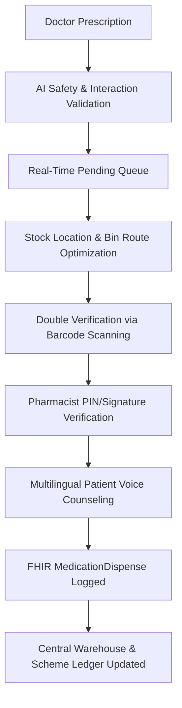

# MCGM HEALTHCARE OPERATING SYSTEM
## PART 15: PHARMACY MANAGEMENT SYSTEM & SMART INVENTORY
### DEVELOPER & ARCHITECTURE DOCUMENTATION

This document defines the architectural specifications, FHIR compliance schemas, ABDM integration workflows, and AI models for the MCGM Pharmacy Management System (Part 15).

---

## 1. SYSTEM ARCHITECTURE & COMPONENT FLOW

The Pharmacy Management System follows a strict, non-repudiable medication lifecycle. Every transaction is timestamped, audited, and cryptographically signed.



### Supported Portals & Interfaces
1. **Hospital OPD Pharmacy:** High-throughput prescription dispensing workstation with waiting queue trackers.
2. **IPD Pharmacy:** Ward-wise dosing drawers, medication administration record (MAR) sync, and automated nurse notification.
3. **Emergency & OT Pharmacies:** Immediate override protocols with post-facto audit trails.
4. **Central & Regional Warehouses:** Bulk goods receipt, lot trace, manufacturer audits, and cold chain telemetry.
5. **Jan Aushadhi Integration:** Automated recommendation engine matching high-cost brand prescriptions to low-cost generic equivalents.

---

## 2. FHIR RESOURCE COMPATIBILITY (HL7 v4.0.1)

To ensure interoperability across government portals and international health records, the pharmacy transactions map to FHIR resources.

### A. FHIR MedicationRequest Resource (Sample Payload)
```json
{
  "resourceType": "MedicationRequest",
  "id": "rx-2026-001",
  "status": "active",
  "intent": "order",
  "category": [
    {
      "coding": [
        {
          "system": "http://terminology.hl7.org/CodeSystem/medicationrequest-category",
          "code": "outpatient",
          "display": "Outpatient"
        }
      ]
    }
  ],
  "medicationCodeableConcept": {
    "coding": [
      {
        "system": "http://www.nlm.nih.gov/research/umls/rxnorm",
        "code": "312320",
        "display": "Paracetamol 650 MG Oral Tablet"
      }
    ],
    "text": "Paracetamol 650mg"
  },
  "subject": {
    "reference": "Patient/devendra-sawant-abha",
    "display": "Devendra Mahadev Sawant"
  },
  "encounter": {
    "reference": "Encounter/enc-99201"
  },
  "authoredOn": "2026-07-09T09:15:00Z",
  "requester": {
    "reference": "Practitioner/dr-ramesh-patil",
    "display": "Dr. Ramesh Patil"
  },
  "dosageInstruction": [
    {
      "sequence": 1,
      "text": "Thrice daily after meals",
      "timing": {
        "repeat": {
          "frequency": 3,
          "period": 1,
          "periodUnit": "d"
        }
      },
      "asNeededBoolean": true,
      "route": {
        "coding": [
          {
            "system": "http://snomed.info/sct",
            "code": "26643006",
            "display": "Oral route"
          }
        ]
      },
      "doseAndRate": [
        {
          "type": {
            "coding": [
              {
                "system": "http://terminology.hl7.org/CodeSystem/dose-rate-type",
                "code": "ordered",
                "display": "Ordered"
              }
            ]
          },
          "doseQuantity": {
            "value": 1,
            "unit": "tablet",
            "system": "http://terminology.hl7.org/CodeSystem/v3-OrderableDrugForm",
            "code": "TAB"
          }
        }
      ]
    }
  ]
}
```

### B. FHIR MedicationDispense Resource (Sample Payload)
```json
{
  "resourceType": "MedicationDispense",
  "id": "disp-99281",
  "status": "completed",
  "medicationCodeableConcept": {
    "text": "Calpol (Paracetamol) 650mg"
  },
  "subject": {
    "reference": "Patient/devendra-sawant-abha"
  },
  "performer": [
    {
      "actor": {
        "reference": "Practitioner/pharmacist-1029",
        "display": "Chief Pharmacist"
      }
    }
  ],
  "authorizingPrescription": [
    {
      "reference": "MedicationRequest/rx-2026-001"
    }
  ],
  "type": {
    "coding": [
      {
        "system": "http://terminology.hl7.org/CodeSystem/v3-ActPharmacySupplyType",
        "code": "FF",
        "display": "First Fill"
      }
    ]
  },
  "quantity": {
    "value": 9,
    "system": "http://unitsofmeasure.org",
    "code": "{Tablets}"
  },
  "daysSupply": {
    "value": 3,
    "unit": "days"
  },
  "whenPrepared": "2026-07-09T11:45:00Z",
  "whenHandedOver": "2026-07-09T11:46:12Z",
  "batch": {
    "lotNumber": "B-P4028",
    "expirationDate": "2027-09-12"
  }
}
```

---

## 3. ABDM (AYUSHMAN BHARAT DIGITAL MISSION) COMPLIANCE

1. **ABHA Verification:** ABHA ID (e.g., `devendra.sawant@abha`) is verified via National Health Authority (NHA) gateways.
2. **Digital Signatures:** Prescriptions contain a cryptographic hash signed by the physician's registered DSC key.
3. **Consent Manager Integration:** Patient grants consent via the ABDM PHR app, authorizing the pharmacy to view active prescription registries.
4. **DPDP Compliance:** No patient health data is printed on shipping or packaging labels beyond mandatory regulatory requirements. All offline storage requires AES-256 local database encryption.

---

## 4. IOT COLD CHAIN TELEMETRY MODEL

Sensitive vaccines and biologics (e.g., Insulin, Covishield) are monitored via real-time IoT sensors. Telemetry packets are sent via MQTT to the central CommandCenter module.

### A. IoT Data Schema
```json
{
  "sensorId": "SENS-02",
  "deviceModel": "ColdTemp-IoT-v4",
  "location": "Insulin Storage (Ref B)",
  "telemetry": {
    "temperatureCelsius": 8.9,
    "humidityPercent": 50,
    "powerSource": "battery_backup",
    "doorOpen": false
  },
  "status": "WARNING",
  "limits": {
    "tempMin": 2.0,
    "tempMax": 8.0
  },
  "timestamp": "2026-07-09T11:28:00Z"
}
```

### B. Trigger Rules
- **Rule 1 (Temperature Warning):** `temp > 8.0°C` or `temp < 2.0°C` for > 15 minutes triggers a WARNING state on the Pharmacist Dashboard.
- **Rule 2 (Critical Alert):** `temp > 12.0°C` or `temp < 0.0°C` for > 30 minutes triggers a CRITICAL alarm, routes alerts to the Command Center, locks the inventory from dispensing, and sends warning notifications to the facility administrator.

---

## 5. AI PHARMACY ASSISTANT & PREDICTION ALGORITHMS

The AI Pharmacy Assistant operates non-invasively to assist store managers and pharmacists:

### A. Seasonal Demand Forecasting
Utilizes a Triple Exponential Smoothing (Holt-Winters) model to predict seasonal medicine spikes (e.g., antipyretics and cough syrups ahead of monsoon outbreaks).
$$\hat{y}_{t+h|t} = \ell_t + h b_t + s_{t+h-m(k+1)}$$
Where $\ell_t$ is level, $b_t$ is trend, and $s_t$ is seasonal components.
- **Input:** Historic monthly consumption records + current weather indicators + public health outbreak alerts.
- **Action:** Generates procurement recommendations 30 days in advance to prevent stock shortages.

### B. Expiry Risk Assessment
Continuous scanning calculates:
$$\text{RiskScore} = \frac{\text{Current Stock Level}}{\text{Average Monthly Consumption} \times \text{Months to Expiry}}$$
- **Action:** If $\text{RiskScore} > 1.5$ (indicating stock will not be depleted before expiry), the system alerts the Store Manager to initiate a transfer request to high-demand regional hospitals.

---

## 6. QUALITY CHECK GATES

Before completing any dispensation or inventory action, the system runs programmatic quality validation checklist checks:

1. **Can medication errors be reduced?**
   - *Check:* Patient allergy verification, SNOMED-CT clinical coding checks, and duplicate therapy warnings.
2. **Can stock wastage be reduced?**
   - *Check:* Cold chain IoT monitoring, FEFO (First Expired, First Out) picking routing guidelines, and isolation locks for recalled batches.
3. **Can patients understand their medicines?**
   - *Check:* Multilingual voice counseling explanation generators (English, Hindi, Marathi) with QR-coded digital guides.
4. **Can pharmacists work faster?**
   - *Check:* Barcode-driven picking confirmation, pre-populated government scheme eligibility, and single-click DSC approval signatures.
5. **Can AI improve safety without overriding clinical judgment?**
   - *Check:* Warnings are presented as advisory cards; pharmacists have override authority with logged rationale.

---

## 7. USER ACCESSIBILITY & INCLUSIVITY

- **Voice Explanation:** Text-to-speech engine reads instructions aloud to patients in their preferred regional language (Marathi, Hindi, English).
- **High Contrast Themes:** Fully validated responsive styles supporting both dark and light modes.
- **Keyboard Shortcuts:**
  - `Ctrl + K` : Focus Global Search Palette.
  - `Alt + D` : Open Dispensing Workspace.
  - `Alt + I` : Open Inventory Medicine Master.
  - `Escape` : Close active modals or clear searches.
